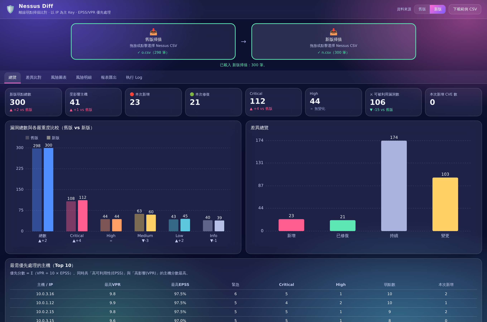
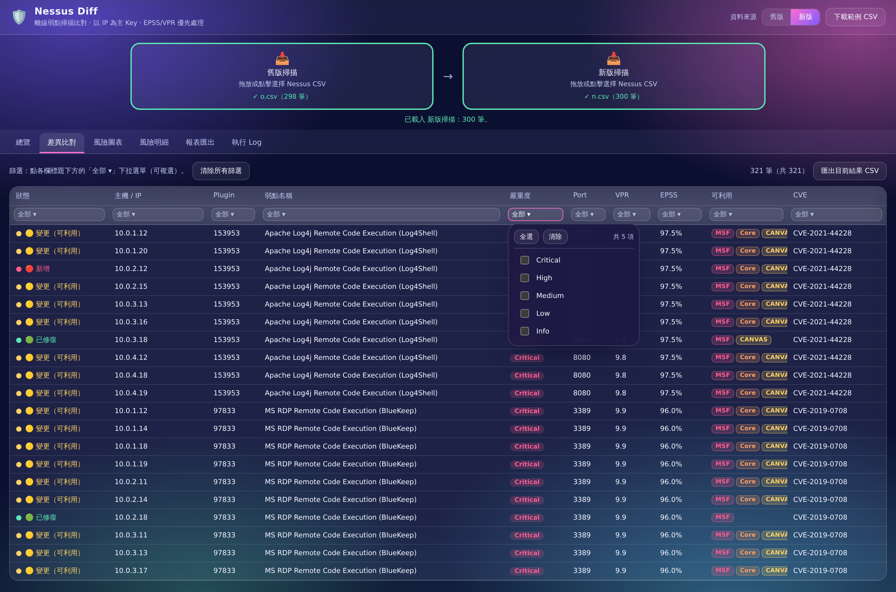
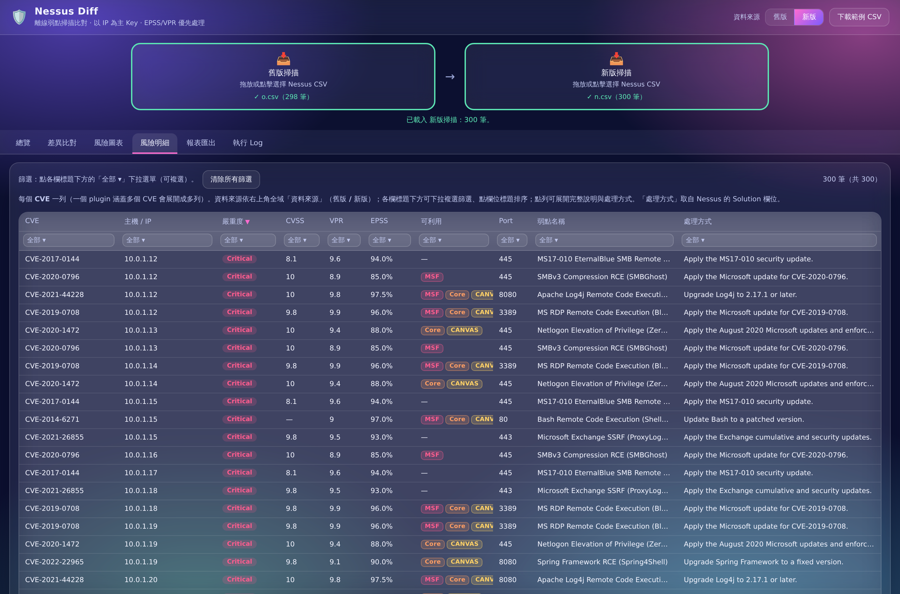
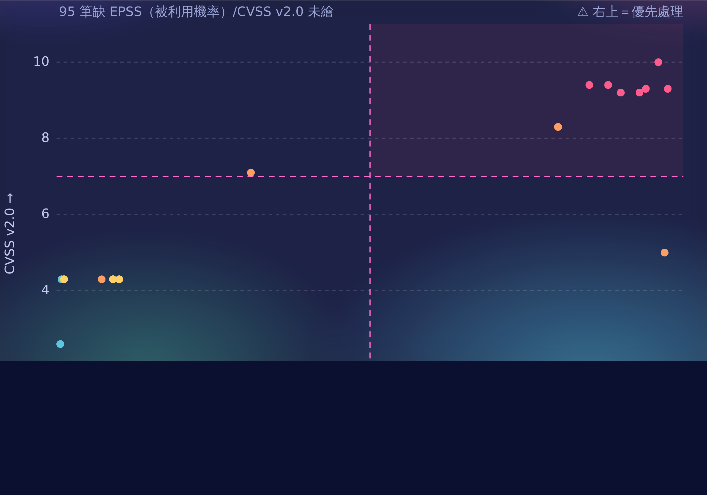
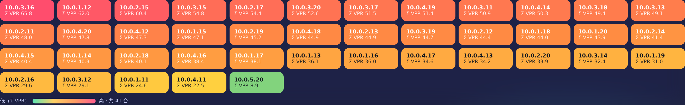
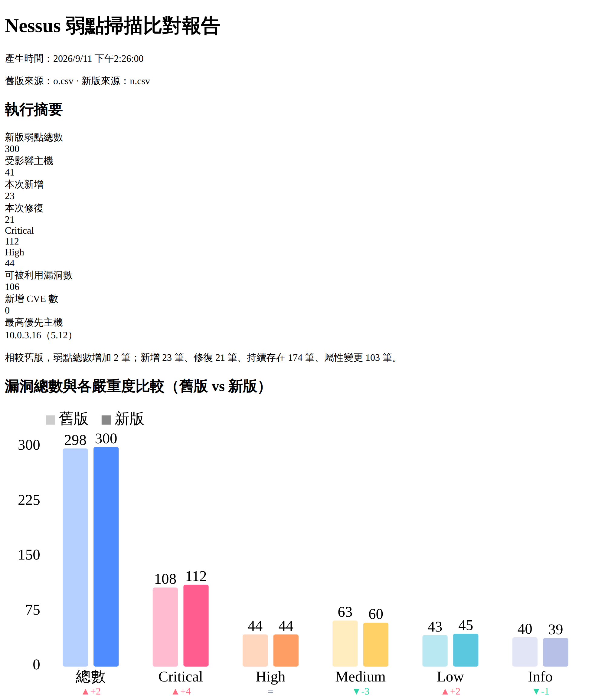

# Nessus Diff — 離線弱點掃描比對工具

一個**完全離線**的桌面工具，讓資安分析師匯入兩份 Nessus 弱點掃描 CSV，**以 IP 為主 Key 快速比對差異**（新增 / 已修復 / 持續 / 變更），並用 **EPSS**（漏洞被實際利用機率）與 **VPR**（Tenable 漏洞優先分數）看出**哪些主機要優先處理**，最後一鍵產出報告。

> 以「不複雜、簡單、順手、低記憶體」為原則設計。主流程只有三步：**匯入兩份 CSV → 看結果 → 匯出報告**。

**下載 Windows 版**：前往 [Releases](https://github.com/zzx789654/nessus-report/releases/latest) 下載安裝版 `Nessus-Diff-Setup-*.exe` 或免安裝版 `Nessus-Diff-Portable-*.exe`（未簽章，首次執行點「其他資訊 → 仍要執行」）。

---

## 畫面預覽

**總覽** — KPI（新版總數 / 主機 / 新增 / 修復 / Critical / High / **可被利用漏洞數** / 新增 CVE）＋ **漏洞總數與各嚴重度比較（舊版 vs 新版）** ＋ 差異總覽 ＋ 最需優先處理主機



**差異比對** — 以 IP 為主 Key 標記新增 / 已修復 / 持續 / 變更；新增「**可利用**」欄（Metasploit / Core Impact / CANVAS 徽章）；**每個欄位標題下方可下拉複選篩選，且為串聯式**（選項只列出「其他欄位篩選後仍存在」的值，避免湊出 0 筆）



**風險明細** — 每個 CVE 一列的矩陣（CVSS / VPR / EPSS / 可利用 / 處理方式），同樣支援欄位標題串聯篩選、點列展開完整說明與 Solution



**風險圖表** — CVSS × EPSS/VPR 優先處理四象限（右上＝最該先修，跟隨全域舊版/新版、不限資料點數）與主機風險熱力圖（可切 Σ VPR / Σ EPSS）

<p>
  
  
</p>

**HTML 報表** — 單一檔案、內嵌 SVG 圖表，可離線開啟或列印成 PDF



---

## 核心特性

| 需求 | 實作 |
|------|------|
| 每次開啟重新匯入、不記憶 | 不使用任何 localStorage / IndexedDB / 檔案快取，資料僅存記憶體；**關閉視窗時作業系統自動回收全部記憶體** |
| 風險明細（每個 CVE） | 「風險明細」分頁：每個 CVE 一列的矩陣（含 CVSS/VPR/EPSS/**可利用**/處理方式），可選舊版/新版 CSV、即時篩選排序、點列展開摘要與 Solution |
| 以 IP 為主 Key 的 CSV 比對 | 以 `Host` 分組，finding key = `Plugin ID + Port + Protocol`；標記**新增 / 已修復 / 持續 / 變更**（變更含風險 / 分數 / CVE / 名稱 / 修補 / **可利用性**改變） |
| 可利用性情資（是否已武器化） | 讀取 Nessus 的 **Metasploit / Core Impact / CANVAS** 欄位（`TRUE/FALSE`），標記漏洞是否已有現成攻擊模組；差異比對與風險明細以徽章顯示、可串聯篩選（依框架或「未武器化」），總覽 KPI「**可被利用漏洞數**」、報表加欄與摘要 |
| 快速篩選與排序（串聯式） | **差異比對與風險明細矩陣的每個欄位標題下方都有下拉複選篩選**（狀態 / 嚴重度 / 主機 / Plugin / Port / CVE / 可利用 為該欄值清單；VPR / EPSS 為區間分級）；**串聯篩選**：每個下拉的選項只列出「通過其他欄位篩選後仍存在」的值（Excel AutoFilter 式，避免湊出 0 筆）；欄內多選為 OR、跨欄為 AND；點欄位標題排序 |
| 風險圖表（CVSS / EPSS / VPR） | **四象限**：縱軸固定 CVSS v2.0、橫軸可切 EPSS 或 VPR（右上=最優先），可切「一點=弱點 / 一點=主機」，**畫出所有具座標的資料點（不設上限）**，資料點 hover 顯示 CVE；另有**漏洞總數與各嚴重度比較**（舊版 vs 新版、含增減量）、差異總覽、**Top 風險主機**（依弱點總數，依嚴重度堆疊長條）、**主機風險熱力圖**（可切 Σ VPR / Σ EPSS）。全分頁支援 **IP 多選篩選**（可搜尋、風險/IP 降序、圖表即時更新），每張圖標示**資料來源**。右上角有**全域「資料來源（舊版/新版）」切換**，驅動四象限/熱力圖/Top 主機與風險明細（差異比對維持對比）；四象限一致跟隨此切換 |
| 漏洞總數統計 | KPI 卡：新版總數、各嚴重度、主機數、新增/修復、**可被利用漏洞數**、新增 CVE 數 + 增減量 |
| 執行 Log | 分級（DEBUG/INFO/WARN/ERROR）、攔截未捕捉錯誤、可匯出 `.log` |
| 報表產出 | 單一 HTML 報表（內嵌 SVG 圖表），可勾選內容、可只納入 Critical/High、可套用目前篩選 |
| 缺欄位處理 / 範例 | 缺**必要**欄位 → 明確錯誤並提示；缺**選用**欄位 → 圖表優雅降級並於 Log 警示；內建「下載範例 CSV」 |
| 大量主機（300+ IP） | **主機風險熱力圖**（一格一台、標 IP 與分數、色階＝優先分數）、四象限可切「一點=一台主機」、風險圖表 IP 多選篩選、風險明細虛擬捲動 |
| 大資料量（萬筆以上） | 差異表與主機表皆**虛擬捲動**（只渲染可見列）、搜尋預建索引、四象限圖限制資料點、預設收斂（隱藏 Info／只看需行動）、統計一次算好快取 |
| 完全離線 | Electron 安全外殼（無網路、`connect-src 'none'`），CDN/外連一律封鎖 |

---

## 執行方式

### 方式一：Electron 桌面 App（建議）

```bash
npm install      # 安裝 Electron（僅開發相依，執行期零相依）
npm start        # 開啟桌面視窗
```

### 方式二：瀏覽器直接開（零安裝備援）

核心邏輯為純前端，直接用瀏覽器開啟 `renderer/index.html` 即可使用（匯出改用瀏覽器下載）。
適合不便安裝 Node 的環境；一樣完全離線。

---

## Nessus CSV 欄位說明

Nessus 匯出的 CSV（Export → CSV）常見欄位如下。本工具**以表頭名稱對應、忽略大小寫、支援別名**，欄位順序不限。

### 必要欄位（缺少則無法匯入）
| 欄位 | 別名 | 用途 |
|------|------|------|
| `Host` | `IP Address`, `IP`, `DNS Name`, `FQDN` | 比對主 Key（主機/IP） |
| `Plugin ID` | `PluginID`, `Plugin` | 弱點識別 |

### 建議欄位（缺少則降級，仍可運作）
| 欄位 | 別名 | 缺少時的處理 |
|------|------|--------------|
| `Risk` | `Severity`, `Risk Factor` | 改由 CVSS 分數推導嚴重度 |
| `Name` | `Plugin Name` | 以 `Plugin <ID>` 代替 |
| `Port` / `Protocol` | `Proto` | 影響 finding 唯一性（同主機不同 port 會併計） |
| `CVSS v2.0 Base Score` | — | 四象限縱軸（固定 v2.0）；整份缺 v2.0 時自動降級用 v3.0 |
| `VPR Score` | `VPR` | 四象限橫軸選項之一 / 優先分數缺該維度 |
| `EPSS Score` | `EPSS` | 四象限橫軸選項之一 / 優先分數改用嚴重度+VPR 降級排序 |
| `CVE` | `CVEs` | 「新增 CVE 數」統計會變少 |
| `CVSS v3.0 Base Score` / `CVSS v2.0 Base Score` | `CVSS` | 無 Risk 時無法推導嚴重度 |
| `Metasploit` | `Exploited by Metasploit` | 缺少 → 該框架視為未收錄（不影響其他判定） |
| `Core Impact` | `Exploited by Core Impact` | 同上 |
| `CANVAS` | `Exploited by CANVAS` | 同上；三者皆缺 → 「可利用」欄空白、「可被利用漏洞數」為 0 |

> 缺少必要欄位時，畫面會列出偵測到的欄位並提示；可點右上「**下載範例 CSV**」對照正確格式。
> `samples/` 內附 `scan_baseline.csv`（舊版）與 `scan_current.csv`（新版）兩份範例，可直接匯入體驗比對。

---

## 優先分數怎麼算

- **每個弱點**：`風險 = (VPR ÷ 10) × EPSS`（同時考量「影響程度」與「被利用機率」，範圍 0~1）。
- **每台主機優先分數**：`Σ（該主機所有弱點的風險）`。分數越高＝該主機累積的「緊急曝險」越大，越該先處理。
- **緊急**欄：同時滿足 `VPR ≥ 7` 且 `EPSS ≥ 50%` 的弱點數（門檻可於四象限圖調整）。
- 若整份資料**沒有 EPSS**，優先分數自動降級為以 `Critical/High 數 + VPR + 弱點量` 排序，仍可運作。

---

## 資安設計（Electron 安全基線）

- `contextIsolation: true`、`nodeIntegration: false`、`sandbox: true`、`webSecurity: true`
- 嚴格 CSP：`default-src 'none'; script-src 'self'; connect-src 'none'`（完全離線、無外連、無注入腳本執行）
- **完全封鎖外連（縱深防禦）**：以 `session.webRequest.onBeforeRequest` 攔截所有非本機（`http/https/ws/ftp…`）請求一律取消，即使 CSP 被繞過也擋得住；`setPermissionRequestHandler` 拒絕所有權限請求
- 封鎖對外導覽與重新導向；開新視窗僅放行報表預覽的 `about:blank`。**不對外開任何連結**——連「交給系統瀏覽器開啟」都不做（v1.8 起移除 `shell.openExternal`），確保沒有任何對外資料路徑
- `preload` 僅以 `contextBridge` 暴露**單一**「另存檔案」API，主行程二次驗證（副檔名白名單、檔名清理、路徑由原生對話框決定，防路徑穿越）
- 顯示層一律用 `textContent` / DOM 建立寫入，報表字串一律 `escapeXml`，杜絕 XSS（含弱點名稱中的 `<script>`/`onerror` payload，已於真實瀏覽器 E2E 驗證不被執行）
- **CSV 匯出防公式注入**：以 `= + - @` 等開頭的儲存格自動前置 `'`
- 不做任何持久化、不連線、不外傳

### 資料完整性（v1.8）

- 數值欄位（CVSS / VPR / EPSS）遇**超界或非數值一律標記為缺值（null）並記錄 issue，不夾到最大值**——避免把異常偽裝成正常資料而誤導判讀；匯入後於執行 Log 條列。
- **EPSS 三種格式**（`0.97` 機率 / `97` 百分比 / `97%`）自動統一為 0~1；換算後仍超界才視為非法。
- **重複列偵測**（相同 Host / Plugin / Port / Protocol）：標記並計數，不自動刪除（重複是掃描品質訊號）。
- **變更分類**：持續存在的弱點會進一步標示變更了「風險 / 分數 / CVE / 名稱 / 修補方式」；新增 CVE 統計涵蓋「持續弱點內容變更後才出現的 CVE」。
- **正式報告欄位**：支援 Description、Plugin Output、See Also、資產資訊（DNS/OS/MAC）、處理狀態、例外原因、負責人、備註；掃描時間由 Scan Information plugin(19506) 擷取，報告保留來源檔名與產製時間以利追溯。

---

## 記憶體與大資料量

- Electron 記憶體佔用天生高於純瀏覽器；本專案將核心放在**精簡 renderer**（vanilla JS + 自繪 SVG、執行期零相依），並：
  - 差異表**虛擬捲動**：無論 10 萬列只渲染畫面可見的約 30 列。
  - 只保留比對/評分/報表所需欄位（不留大型描述文字），降低每列記憶體。
  - 四象限圖**畫出所有具座標的資料點（不設上限）**，改用單一 SVG 事件委派做 hover 命中（上萬點仍流暢）；報表明細上限 3000 列。
  - Log 環狀上限 5000 筆。
- **大檔串流解析（v1.8）**：改用可續傳的串流解析器（`file.stream()` 逐塊讀取，正確處理跨區塊的 `""` 跳脫與 CRLF），匯入時**顯示進度、可取消**，並設 200MB 檔案大小上限；不再整檔一次讀入。
- 實測：合成 6 萬列串流解析 + 正規化 + 比對 < 1 秒（`npm test` 第 [13] 項）；兩份各 5 萬列（共 10 萬弱點）解析約 0.5 秒、比對約 0.45 秒，heap 約 130MB。
- **關閉視窗即結束行程，作業系統自動回收全部記憶體**（不需手動清除）。

### 兩種規模的畫面策略

| 情境 | 問題本質 | 畫面優化 |
|------|----------|----------|
| **300+ 個 IP** | 「看不完」——渲染不難，難在人無法一次消化上百台主機 | **主機風險熱力圖**（一格一台、標 IP 與優先分數、色階＝分數，一眼看出高風險群落）；**Top 風險主機**長條；風險圖表 **IP 多選篩選**（風險/IP 降序）；四象限可切「一點＝一台主機」避免上千弱點點重疊 |
| **1 萬筆以上** | 「渲染／運算」量大 | 差異表與主機表**皆虛擬捲動**（無論幾萬列只渲染畫面可見約 30 列）；**搜尋預建小寫索引**（篩選不每鍵重算）；四象限不設點數上限（事件委派 hover）、熱力圖限 600 格、報表明細限 3000 列；**預設收斂**（隱藏 Info、可一鍵「只看需行動＝新增/變更/Critical/High」）降低認知負擔 |

> 實測：兩份各 1 萬筆（共 2 萬筆、橫跨 300 台主機、5 個網段）匯入＋比對約 1.3 秒；差異表 2 萬列僅渲染約 4 列可見、主機表 300 台僅渲染約 17 列可見；全程 0 錯誤。

---

## 專案結構

```
nessus-report/
├─ main.js              Electron 主行程（安全外殼 + 另存檔案 IPC）
├─ preload.js           contextBridge 最小 API
├─ renderer/
│  ├─ index.html        UI 結構 + 嚴格 CSP
│  ├─ styles.css        深色、精簡樣式（無外部資源）
│  ├─ core.js           純邏輯：解析 / 欄位對應 / diff / 統計 / 優先分數（瀏覽器與測試共用）
│  └─ app.js            renderer：UI、虛擬表格、SVG 圖表、報表、Log、匯出
├─ build/icon.png       App 圖示（electron-builder 打包用）
├─ samples/             範例 CSV（舊版 / 新版）+ 範例報表.html
├─ docs/screenshots/    README 畫面預覽圖
├─ test/run-tests.js    核心邏輯測試（Node，零相依）
├─ test/e2e.js          真實瀏覽器 E2E（playwright-core + 預裝 Chromium）
├─ .github/workflows/release.yml   CI/CD：推 v* tag 打包並發佈 Windows Release
└─ package.json
```

## 測試

```bash
npm test      # 177 項核心邏輯測試（解析 / 欄位 / diff / 統計 / 優先分數 / 可利用性 / 資料完整性 / 非法值 / 重複 / 變更分類 / 大量效能 / 防注入 / 離線邊界靜態不變式）
npm run test:e2e   # 真實 Chromium 端對端：GUI 匯入、XSS 未執行、外連被 CSP 擋、明細呈現正式報告欄位
npm run test:all   # 兩者一起跑
```

---

## 打包與發佈（Windows 桌面 App）

以 [electron-builder](https://www.electron.build/) 打包，設定在 `package.json` 的 `build` 區塊，App 圖示為 `build/icon.png`。

**本機打包**（產出於 `dist/`，不會上傳）：

```bash
npm install
npm run dist        # electron-builder --win（NSIS 安裝檔 + Portable 免安裝版）
```

**CI/CD 自動發佈**：`.github/workflows/release.yml` 會在**推送 `v` 開頭的 tag**（例如 `v1.11.0`）或於 Actions 手動 **Run workflow（Branch: main）** 時，於 `windows-latest` runner 上跑核心測試 → 打包 → 以內建 `GITHUB_TOKEN` 發佈到對應的 GitHub Release。

```bash
git tag v1.11.0
git push origin v1.11.0     # 觸發 Release 工作流程（或改用 Actions → Run workflow）
```

> ⚠️ 目前**未做程式碼簽章 / 公證**：Windows 首次執行會跳 SmartScreen（點「其他資訊 → 仍要執行」），這對未簽章的內部工具屬正常現象。若要消除，需另備 EV/OV 憑證於 CI 簽章。

---

## 使用套件（BOM）

本工具刻意維持**極小依賴面**，以符合「完全離線、最小攻擊面、可稽核」的設計目標。

### 執行期相依（Runtime）— **零**
- renderer 為**純 vanilla JavaScript（ES2019）＋ 自繪 SVG 圖表**，**不使用任何第三方前端函式庫、框架、CDN 或 web 字型**（CSV 解析、diff、統計、優先分數、虛擬捲動、圖表全部自寫）。
- 打包後的 `.exe` 內含的執行環境為 **Electron 內嵌的 Chromium ＋ Node.js runtime**（Electron 本質使然），本專案自身程式碼零外部執行期套件。

### 開發／打包相依（devDependencies）
| 套件 | 版本 | 用途 | 授權 |
|------|------|------|------|
| [electron](https://www.npmjs.com/package/electron) | `^31.0.0` | 桌面外殼執行環境（Chromium + Node）；`npm start` 開發、打包後為 App runtime | MIT |
| [electron-builder](https://www.npmjs.com/package/electron-builder) | `^24.13.3` | 打包 Windows NSIS 安裝檔 / Portable 免安裝版、產生 GitHub Release 資產 | MIT |

### 測試／驗證工具（不隨 App 發佈）
| 工具 | 用途 |
|------|------|
| Node.js 內建（零相依） | `npm test`：177 項核心邏輯單元測試 |
| [playwright-core](https://www.npmjs.com/package/playwright-core) ＋ 環境預裝 Chromium | `npm run test:e2e`：真實瀏覽器端對端驗證（GUI 匯入、XSS 未執行、外連被 CSP 擋）；找不到時自動略過，**不影響 App 打包** |

> **供應鏈稽核**：本專案 `package.json` 的 `dependencies` 為**空**，僅有上述兩個開發相依。
> 要產生完整（含遞移）相依清單或 SBOM，可執行 `npm ls --all`，或以 CycloneDX：`npx @cyclonedx/cyclonedx-npm --output-file sbom.json`。
> 這些遞移相依僅存在於**開發／打包階段**，不會進入離線執行的 renderer。

---

## 授權

MIT
